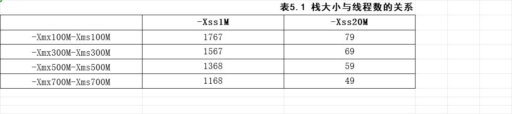
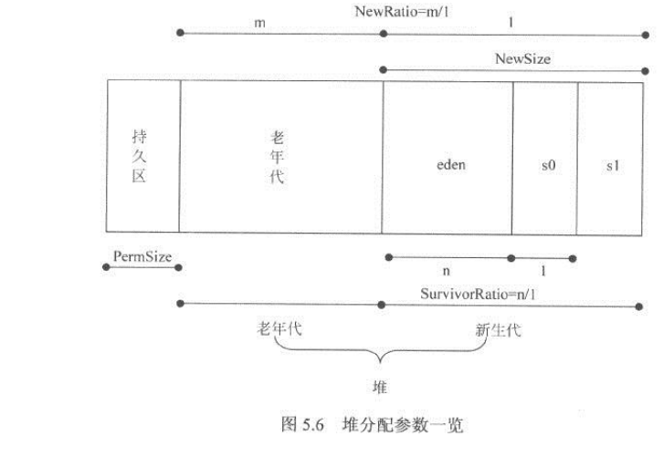

## 设置最大堆内存

Java应用程序可以使用的最大堆可以用-Xmx参数指定。最大堆指的是新生代和老年代的大小之和的最大值，它是Java应用程序的堆上限。

## 设置最小堆内存

使用JVM参数-Xms可以用于设置系统的最小堆空间。也就是JVM启动时，所占据的操作系统内存大小。

Java应用程序在运行时，首先会被分配-Xms指定的内存大小，并尽可能尝试在这个空间段内运行程序。当-Xms指定的内存大小确实无法满足应用程序时，JVM才会向操作系统申请更多的内存，直到内存大小达到-Xmx指定的最大内存为止。若超过-Xmx的值，则抛出OutOfMemoryError异常。

如果-Xms的数值较小，那么JVM为了保证系统尽可能地在指定内存范围内运行，就会更加频繁地进行GC操作，以释放失效的内存空间，从而，会增加Minor GC和Full GC的次数，对系统性能产生一定的影响。

***注意***：JVM会试图将系统内存尽可能限制在-Xms中，因此，当内存实际使用量触及-Xms指定的大小时，会触发Full GC。因此把-Xms值设置为-Xmx时，可以在系统运行初期减少GC的次数和耗时。

## 设置新生代

参数-Xmn用于设置新生代的大小。设置一个较大的新生代会减小老年代的大小，这个参数对系统性能以及GC行为有很大的影响。新生代的大小一般设置为整个堆空间的1/4到1/3左右。

在Hot Spot虚拟机中，-XX:NewSize用于设置新生代的初始大小，-XX:MaxNewSize用于设置新生代的最大值。但通常情况下，只设置-Xmn已经可以满足绝大部分应用的需要。设置-Xmn的效果等同于设置了相同的-XX:NewSzie和-XX:MaxNewSize。

若设置不同的-XX:NewSize和-XX:MaxNewSize可能会导致内存震荡，从而产生不必要的系统开销。

## 设置持久代

持久代(方法区)不属于堆的一部分。在Hot Spot虚拟机中，使用-XX:MaxPermSize可以设置持久代的最大值，使用-XX:PermSize可以设置持久代的初始大小。

持久代的大小直接决定了系统可以支持多少个类定义和多少常量。对于使用CGLIB或者Javassist等动态字节码生成工具的应用程序而言，设置合理的持久代大小有助于维持系统稳定。

## 设置线程栈

在JVM中，可以使用-Xss参数设置线程栈的大小。

在线程中进行局部变量分配，函数调用时，都需要在栈中开辟空间。如果栈的空间分配太小，那么线程在运行时，可能没有足够的空间分配局部变量或者达不到足够的函数调用深度，导致程序异常退出；如果栈空间过大，那么开设线程所需的内存成本就会上升，系统所能支持的线程总数就会下降。

由于Java堆也是向操作系统申请内存空间的，因此，如果堆空间过大，就会导致操作系统可用于线程栈的内存减少，从而间接减少程序所能支持的线程数量。

如果指定系统的最大堆，则会发现，系统所能支持的线程数量，还与堆的大小有关。结合最大堆参数和栈参数，进行若干次实验，查看系统支持的最大线程数，结果如表所示。

表5.1栈大小与线程数的关系

这并不是由于堆内存不够而导致的OOM,而是因为操作系统内存减去堆内存后，剩余的系统内存不足而无法创建新的线程。在这种情况下，可以尝试减少堆内存，以换取更多的系统空间，来解决这个问题。

***注意***：这是一种非常特殊的OutOfMemoryError。它不是因为堆内存不够而溢出，而是因为栈空间不够。为了赢得更多的栈空间，可以适量减少(而不是增加)堆的大小，从而尽可能避免这种OutOfMemoryError异常。

综上所述，如果系统确实需要大量线程并发执行，那么设置一个较小的堆和较小的栈，有助于提高系统所能承受的最大线程数。

## 堆的比例分配

## 总结

与Java应用程序堆内存相关的JVM参数有：
1. -Xms:设置Java应用程序启动时的初始堆大小。
2. -Xmx:设置Java应用程序能获得的最大堆大小。
3. -Xss:设置线程栈的大小。
4. -XX:MinHeapFreeRatio:设置堆空间最小空闲比例。当堆空间的空闲内存小于这个数值时，JVM便会扩展堆空间。
5. -xX:MaxHeapFreeRatio:设置堆空间的最大空闲比例。当堆空间的空闲内存大于这个数值时，便会压缩堆空间，得到一个较小的堆。
6. -XX:NewSize:设置新生代的大小。
7. -xX:NewRatio:设置老年代与新生代的比例，它等于老年代大小除以新生代大小。
8. -XX:SurviorRatio:新生代中eden区与survivior区的比例。
9. -XX:MaxPermSize:设置最大的持久区大小。
10. -XX:PermSize:设置永久区的初始值。
11. -xX:TargetSurvivorRatio:设置survivior区的可使用率。当survivior区的空间使用率达到这个数值时，会将对象送入老年代。

